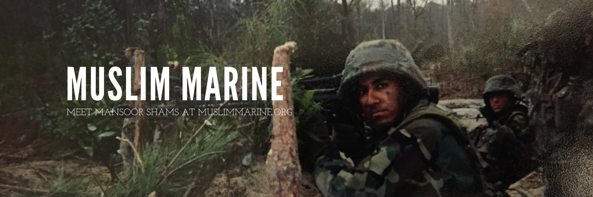
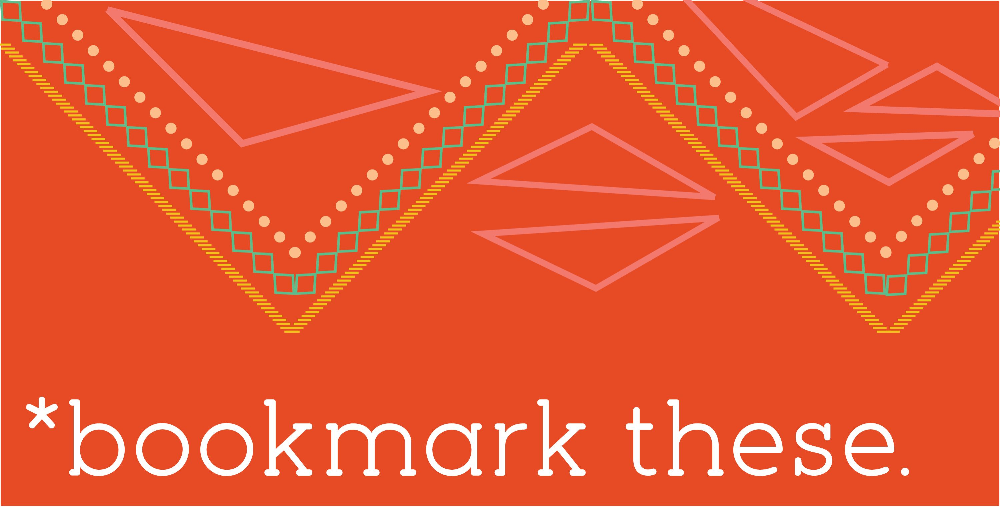
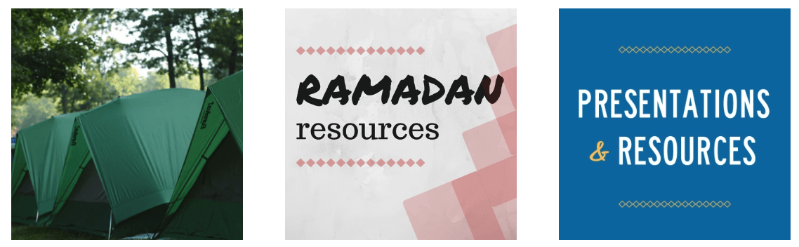
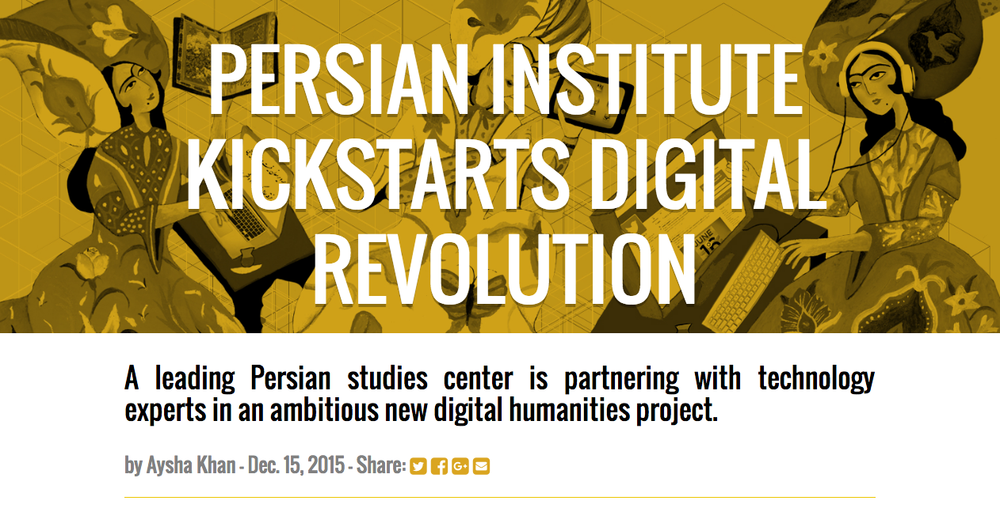
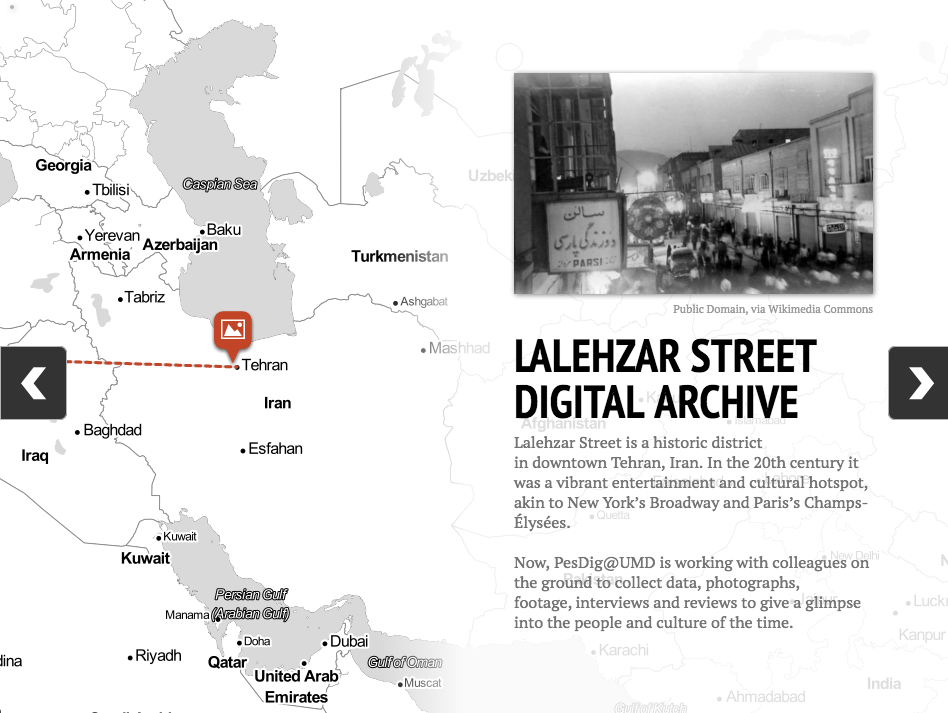
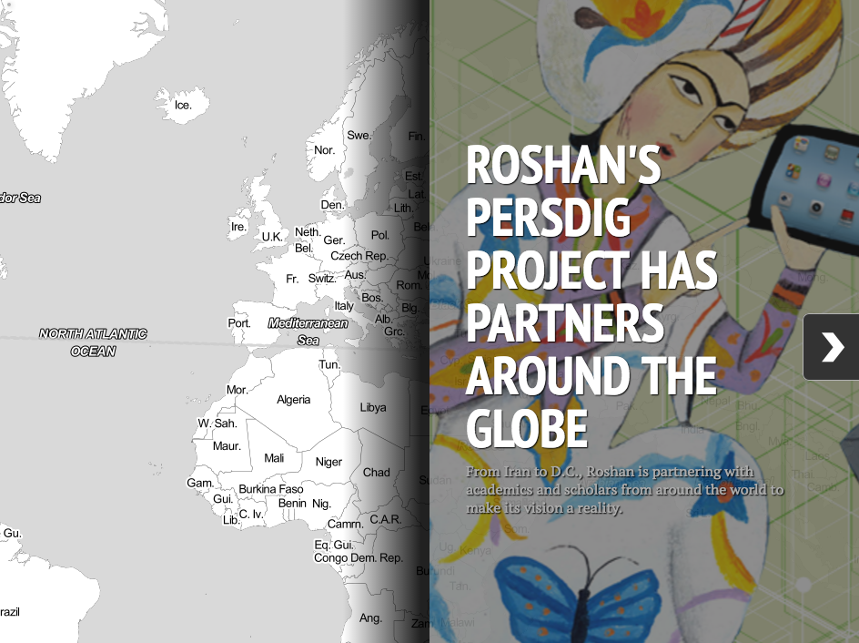
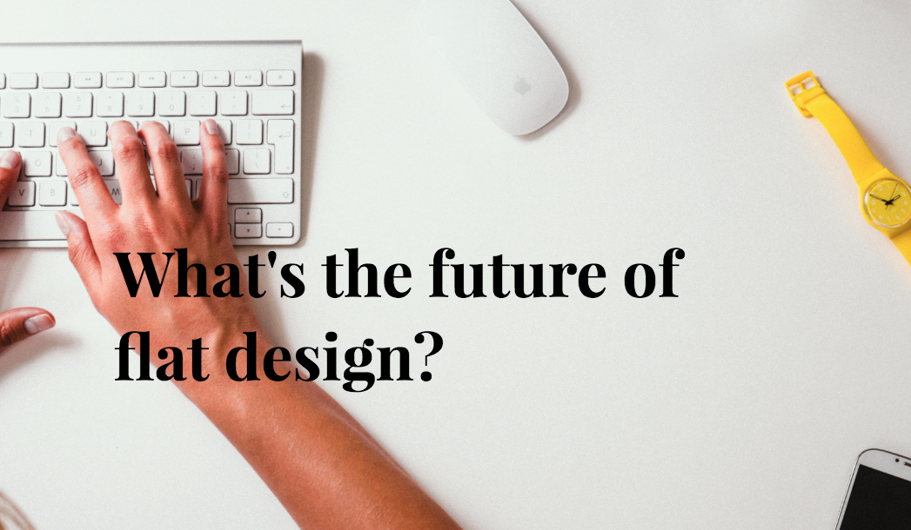
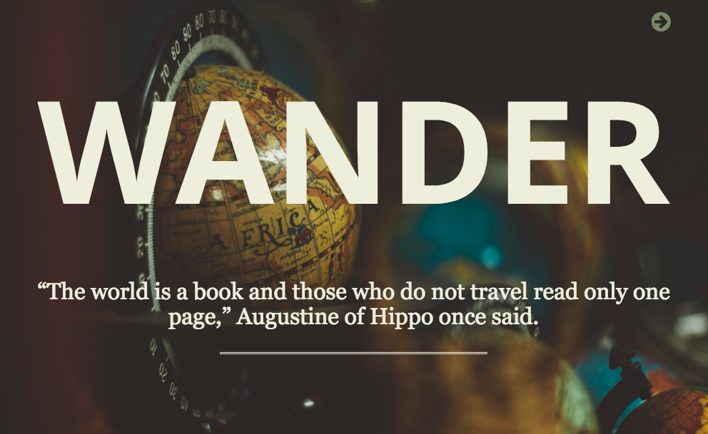
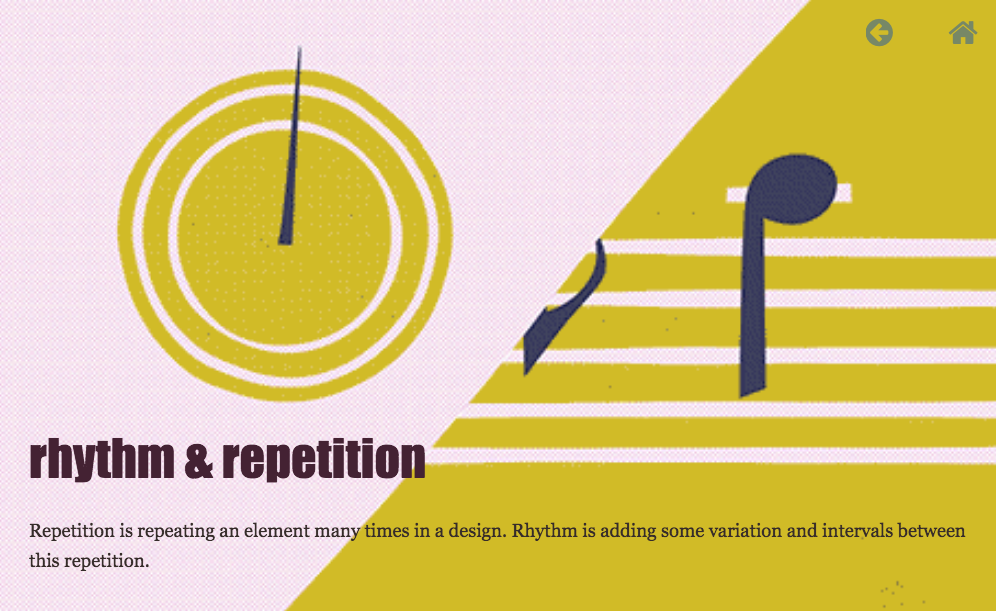

#### **Muslim Marine**

I created and a maintain [a website](http://muslimmarine.org) on Squarespace for a client looking to make media appearances showing his unique perspective on patriotism as a Muslim veteran. I also designed branded graphic elements including his logo, Twitter header and print letterhead. He has since been featured by the New York Times, the BBC, MSNBC, Al Jazeera, The Washington Post, Voice of America, BuzzFeed and more leading news outlets.

#### **Aysha.us**

After years of using Wordpress and a handcoded HTML5 site, I recently switched my personal webpage to using [Jekyll](https://jekyllrb.com/), a tool that allows for static website development with no need for a database or content management system, based on the open-source [Minima](https://github.com/jekyll/minima) theme. The site is hosted on GitHub Pages.

#### **Spiritual Fitness**

I created and maintain a Wordpress website for the Ahmadiyya Muslim Community's national [Spiritual Fitness project](http://spiritualfitness.us). I also created all the graphic elements there and write most of the site's copy, part of the branding work I led there. I also lead the project's [Twitter account](https://twitter.com/spiritualfit) for several years, bringing the follower count from 0 to well over 1,500 users.

#### **Interactive storytelling**

I wrote an article about a groundbreaking Persian digital humanities project and designed a [responsive webpage](http://www.jclass.umd.edu/652352/2015fall/lhoffmann/khan/index.html) with multimedia elements – original photography, a longform interview hosted on Soundcloud, and an interactive map using the Storymap.js Javascript library –  built with HTML5 and CSS. 

I wrote a short piece on the future of web design trends and created a [quick responsive webpage](http://codepen.io/ayshak/pen/RaMZNo) for it using HTML5 and CSS. 

I also used HTML5, CSS3, Javascript and a number of third-party APIs and Javascript libraries to create a responsive, interactive slideshow. You can see that [here](http://codepen.io/seemaysh/pen/jqGjWe).
