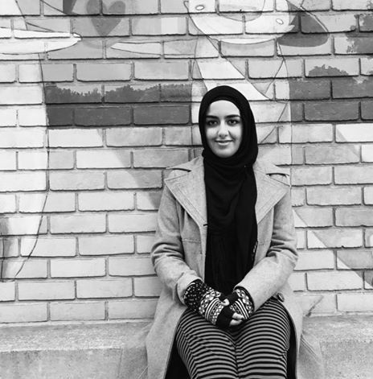

---
# You don't need to edit this file, it's empty on purpose.
# Edit theme's home layout instead if you wanna make some changes
# See: https://jekyllrb.com/docs/themes/#overriding-theme-defaults
layout: home
title: Home
---

### **Hey, there!**

I’m a journalist and web producer based just outside Baltimore. My work focuses on religion, underrepresented communities, technology and the intersections therein. Usually that means covering Muslim American issues and experiences, or exploring cool ways techies and artists are pushing society forward.

My reporting has been published in The Washington Post, USA Today, ThinkProgress, American Journalism Review, Sojourners and other outlets. (Find my clips [here](http://aysha.us/bylines/).) Sometimes I do web design, social media, data visualization and graphics, too, so if you want you can call me a digital journalist. (My web portfolio is [here](http://aysha.us/digital/).)

I’ve worked at the Religion News Service, The Tempest, and the Journalism Center on Children and Families. I recently graduated from the University of Maryland, where I studied multiplatform journalism and Middle Eastern affairs. There, I ran [Plex](https://medium.com/umdplex), an independent, award-winning student news site highlighting diversity and activism.

In particular, I’m actively looking for opportunities to expand my portfolio of writing in the following beats: digital culture, cybersecurity, mass and targeted surveillance, civic technology and activism, South Asian culture and religion, Muslim American issues and sectarianism in Islam.